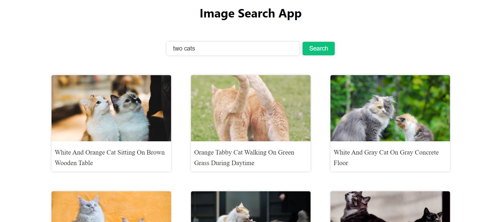

# Image Search Engine using Unsplash api
* I have used fetch API to request to unspash website and bring the json data and show them in my website. *

## build with-

## Live Demo [Click Here](https://vishalgiri8767.github.io/Image-Search-Engine/)

## Preview

